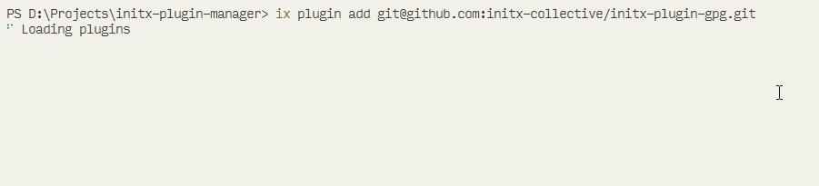

# stagetty

TTY stage renderer with a rolling log window for CLI tools.



`stagetty` is a small utility for stage-based terminal output with:

- spinner title rows
- rolling output windows
- grouped output using `│` and `└`
- a convenience wrapper for running subprocess commands

## Install

For local development inside another project:

```bash
pnpm add ../stagetty
```

After publishing, install it from npm with your chosen package name.

## Usage

```ts
import { runStageCommand } from 'stagetty'

await runStageCommand('Installing dependencies', 'pnpm', ['install'], {
  cwd: process.cwd(),
  maxLines: 5
})
```

## Custom Renderer

```ts
import { DEFAULT_SPINNER_FRAMES, StageRenderer } from 'stagetty'

const renderer = new StageRenderer('Building package', {
  maxLines: 6,
  spinnerFrames: DEFAULT_SPINNER_FRAMES,
  spinnerInterval: 100
})

renderer.start()
renderer.appendLine('Resolving entry files')
renderer.appendLine('Bundling modules')
renderer.finishSuccess()
```

## API

### `new StageRenderer(title, options?)`

Creates a renderer instance for one stage.

### `runStageCommand(title, command, args?, options?)`

Runs a subprocess with streaming output and renders the latest lines in place.

### Options

- `maxLines`: maximum number of visible output lines, default `5`
- `spinnerFrames`: custom spinner frames
- `spinnerInterval`: spinner frame interval in milliseconds, default `100`
- `cwd`: working directory for subprocess execution
- `shell`: override shell execution behaviour
- `env`: extra environment variables for subprocess execution
- `stdout`: custom output stream for rendering
- `stderr`: custom error stream for rendering

## Acknowledgement

- [ora](https://github.com/sindresorhus/ora)
